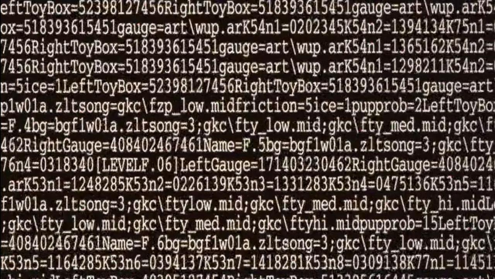
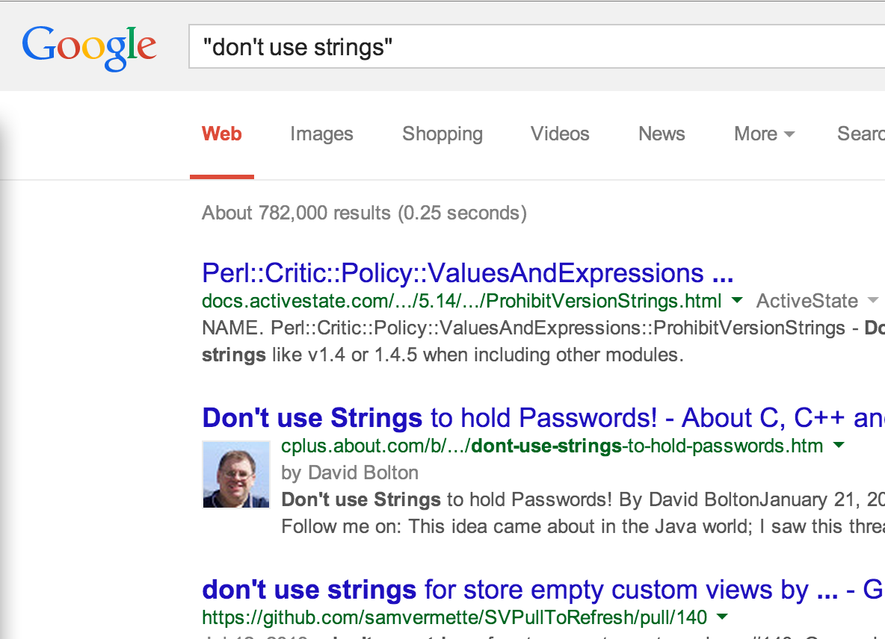

# Complexity and Reasoning in Functional Programming

[Kris Nuttycombe](http://github.com/nuttycom)

April 19, 2014

---------

> "Let me take you on an adventure which will give you superpowers." --[`@bitemyapp`](https://twitter.com/bitemyapp/status/455464035987623936)

I believe that it is possible to write perfect software. By "perfect", I mean
something very specific: that every state that is representable in source code
is a valid state, and that no invalid states may be obtained by the process of
assembly of the program's components. 

An invalid state is one that is unexpected; naturally, such a state
definitionally is one that the programmer has not prepared the program to
operate correctly from.

# Complexity 

When we talk about software programs, we use the word complexity to refer to a
lot of different things; some, like big-O complexity of algorithms and
Kolmogorov complexity, are well-defined; much more frequently, we throw the
word complexity around to refer and vague and handwavey notions of
comprehensibility, maintainability, and so forth. 

Throughout this talk though, I'm going to strive to focus on a single
definition when I refer to complexity: how many different possible states can a
program represent?

---------

## What is a program?

A program serves a single purpose: to describe the transformation of
information from one form to another. Most of the time, this transformation
involves many intermediate steps, and may involve various parties along the way
responsible for providing or interpreting the data being transformed. 

You'll note that I say "describes the transformation" rather than "transforms."
Even if a program is never evaluated, it describes a fact about the universe:
that some input data can be combined or reduced to yield some output data. 

Now, I'm going to write the simplest program possible.

By the way. I'm going to jump confusingly back and forth between Haskell and
Scala in this talk, mostly because I don't know Haskell very well. For most
things, it's just flat out better at expressing them than Scala is, but I think
that for some other things, until you get used to Haskell syntax, Scala is
better. This is an opinion some of you will probably throw tomatoes at me for
holding; that's fine.

---------

## A very simple program

~~~{.haskell }

True
  
~~~

This program can represent only a single state.

Martial arts anecdote.

--------

~~~{.haskell}

data Bool = True | False

bool :: Bool
  
~~~

`::` is pronounced, "has type".  

So the program `bool` has type Bool.  

How many states can the program `bool` represent?

Of course, 1 + 1 = 2

Right, there are two states that a boolean program can occupy.  Since this is a
pure program and it has no inputs, it'll always return the same one, of course,
but we can't tell which one from the type, so we'll treat it as occupying both.

---------

The following program represents an application with 2^32^ possible states.

~~~{.haskell}

i :: Int32
  
~~~

And this one is just awful...

~~~{.haskell}

s :: String
  
~~~

---------

Let's get a little more involved. How many states does this program represent?

~~~{.haskell}

tuple :: (Bool, Int32)
  
~~~

* 2^32^ states if the value on the left is True
* 2^32^ states if it's False

* 2 * 2^32^ = 2^33^ possible states in total

---------

## Products

~~~{.haskell}
ints :: (Int32, Int32)

tuple3 :: (Bool, Bool, Int32)
~~~

~~~{.haskell}
-- if we had type-level functions...
states :: Type -> Nat

states Bool = 2
states Int32 = 2^32

states (Int32, Int32) = 2^32 * 2^32 = 2^64
states (Bool, Bool, Int32) = 2 * 2 * 2^32 = 2^34

states (a, b) = states a * states b
states (a, b, c) = states a * states b * states c

{--
For tuples, we always multiply; we call these "product" types as a result.  
The number of possible states is the cartesian product of the members' 
possible states.
--}
~~~

---------

## Sums

~~~{.haskell}

data Bool = True | False

data Maybe a = Just a | Nothing

data Either a b = Left a | Right b
  
~~~

Bool, Maybe and Either are called sum types. 

~~~{.haskell}

states Bool = 2
states (Maybe t) = states t + 1
states (Either a b) = states a + states b
  
~~~

---------

## Sums in Scala

~~~{.scala}

sealed trait Maybe[+A]

case class Some[A](a: A) extends Maybe[A]

case object None extends Maybe[Nothing]
  
~~~

---------

# Product Bias 

~~~{.haskell}

maybe :: Maybe Int32

-- (Just) 2^32 + (Nothing) 1
  
~~~

Most languages emphasize products.

Many don't allow you to define a type representing 2^32^ + 1 states well.

In programming, languages influence the kinds of data structures that we end up
using by making different things easy. 

Unfortunately, most mainstream languages today make it really easy to define
product types, but at very least more challenging or verbose to define sum
types. 

The effect of this is that most languages encourage coders to try to define
their programs in terms of product types (objects!) and in doing so encourage
them to choose representations that literally multiply the complexity of their
programs.

---------

~~~{.java}
interface EitherVisitor<A, B, C> {
  public C visitLeft(Left<A, B> left);
  public C visitRight(Right<A, B> right);
}

interface Either<A, B> {
  public <C> C accept(EitherVisitor<A, B, C> visitor);
}

public final class Left<A, B> implements Either<A, B> {
  public final A value;
  public Left(A value) {
    this.value = value;
  }

  public <C> C accept(EitherVisitor<A, B, C> visitor) {
    return visitor.visitLeft(this);
  }
}

public final class Right<A, B> implements Either<A, B> {
  public final B value;
  public Right(B value) {
    this.value = value;
  }

  public <C> C accept(EitherVisitor<A, B, C> visitor) {
    return visitor.visitRight(this);
  }
}
~~~

--------

## Minimization

The best way to handle errors in a program is not to allow them in the first place.
We want to make error states *unrepresentable.*

To do this, we need to minimize the state space of our program.

Primitive types are, in general, pretty terrible for this.

Int32 is probably not be a very good type for your domain. What if negative
values should be regarded as invalid? What if the maximum value you should ever
expect to encounter is 42? 

And of course, strings are just awful.

--------

# Strings

_782,000? Not nearly enough._

--------

> The type `String` should only ever appear in your program when a value
> is being shown to a human being.

--------

## Two egregious offenders

* Strings as dictionary keys

* Strings as serialized form

_so seductive_

Why are strings any worse than any other (potentially infinite) data structure?
It's that they're convenient.

A very common misfeature is to use strings as a serialization mechanism.

Serializing values as strings is really appealing, because you can just read
the serialized form directly for debugging and so forth. The value of this in
badly written systems isn't to be understated, but the goal is to write perfect
systems.

I'm not saying don't ever use strings. But I am saying that String is a data
type of last result, and that if you're ever going to be encoding any semantic
information into strings you'd better have bulletproof validation on your
serialization and deserialization.

--------

## Mitigation

Use newtypes liberally.

~~~{.haskell}

newtype Name = Name { strValue :: String }
-- don't export strValue unless you really, really need it
  
~~~

~~~{.scala}

case class Name(strValue: String) extends AnyVal
  
~~~

**Never, ever pass bare String values unless it's to `putStrLn` or equivalent.**

**Never, ever return bare String values  except from `readLn` or equivalent**

If a string is serving any purpose other than display in your system, then it
has semantic meaning that should be tracked by the type system. 

--------

## Mitigation

Hide your newtype constructor behind validation.

~~~{.scala}

case class IPAddr private (addr: String) extends AnyVal

object IPAddr {
  val pattern = """(\d{1,3})\.(\d{1,3})\.(\d{1,3})\.(\d{1,3})""".r

  def parse(s: String): Option[IPAddr] = for {
    xs <- pattern.unapplySeq(s) if xs.forall(_.toInt <= 255)
  } yield IPAddr(s)
}
  
~~~

We've shrunk down an infinite number of states to (256^4^ + 1).
Given the inputs, that's the best we can do.

This applies to virtually every primitive type. Of course, you need to be
cautious of boxing in languages where this is relevant and code is
performance-sensitive, but even in high-performance applications it's rare that
you're passing large numbers of values around individually; newtype entire
collection types if necessary.

Make the compiler work for you.

We have another couple of tools to use when we're thinking about
minimization.

--------

## Isomorphisms

~~~{.haskell}

tuple :: (Bool, Int32)
-- 2^33 states

either :: Either Int32 Int32
-- 2^33 states
  
~~~

These types are isomorphic.

Choose whichever one is most convenient to work with for your purpose.

--------

## Larger Sums

Thus far the sum types we've been talking about have just had two inhabitants.
But it's frequently useful to have more.

~~~{.scala}

sealed trait JValue
case class JString(s: String) extends JValue
case class JNumber(d: BigDecimal) extends JValue
case class JBool(b: Boolean) extends JValue
case class JArray(xs: List[JValue]) extends JValue
case class JObject(fields: Map[String, JValue]) extends JValue
  
~~~

You'll very frequently see sum types like this one referred to as algebraic
data types. This is a little confusing.

--------

# Errors

_If it can go wrong, give that wrongness a type._

We have some good types for error handling in functional languages.

I'm just going to go very quickly into a couple here.

The defining characteristic you'll note is that they're all sums.

Since I use it every day, the examples I'm going to give are going
to be in scala (from scalaz).

--------

## import scalaz._

Three very useful types:

* `A \/ B`

* `Validation[A, B]`

* `EitherT[M[_], A, B]`

The important thing to note here is that all three of these are
sum types where the error type conventionally comes on the left.

--------

**`MyErrorType \/ B`**

* `\/` (Disjunction) has a Monad biased to the right

* We can *sequentially* compose operations that might fail

* `for` comprehension syntax is useful for this

~~~{.scala}

import scalaz.std.syntax.option._

def parseJson(s: String): ParseError \/ JValue = ???
def ipField(jv: JValue): ParseError \/ String = ???

// remember me?
object IPAddr {
  def parse(s: String): Option[IPAddr] = ???
}

for {
  jv <- parseJson("""{"hostname": "nuttyland", "ipAddr": "127.0.0.1"}""")
  addrStr <- ipField(jv)
  ipAddr <- IPAddr.parse(addrStr) toRightDisjunction {
    ParseError(s"$addrStr is not a valid IP address")
  }
} yield ipAddr
  
~~~

--------

**`Validation[NonEmptyList[MyErrorType], B]`**

* Validation **does not** have a Monad instance.

* Composition uses Applicative: conceptually parallel!

* if you need sequencing, `.disjunction`

~~~{.scala}

type VPE[B] = Validation[NonEmptyList[ParseError], B]

def hostname(jv: JValue): VPE[String] = ???
def ipField(jv: JValue): ParseError \/ String = ???

def parseIP(addrStr: String): ParseError \/ IPAddr = 
  IPAddr.parse(addrStr) toRightDisjunction {
    ParseError(s"$addrStr is not a valid IP address")
  }

def ipAddr(jv: JValue): VPE[IPAddr] = 
  (ipField(jv) >>= parseIP).validation.leftMap(nels(_)) 

def host(jv: JValue) = 
  ^[VPE, String, IPAddr, Host](hostname(jv), ipAddr(jv)) { Host.apply _ }
  
~~~

There is a functor isomorphism between `\/` and validation.

This means that these types have the same information content,
but we require there to be distinct types so that we can have
different semantics with respect to how we compose values of
these types

Let's be honest; this'd be nicer in Haskell. At some point I'll
rewrite the example.

--------

**`EitherT[M[_], MyErrorType, B]`**

* EitherT layers together two effects:

    - The "outer" monadic effect of the type constructor M[_]

    - The disjunctive effect of `\/`

~~~{.scala}

// EitherT[M, A, B] <~> M[A \/ B]

// forSome A . Monad[M] => Monad[[b]EitherT[M, A, b]]

def findDocument(key: DocKey): EitherT[IO, DBErr, Document] = ???
def storeWordCount(key: DocKey, wordCount: Long): EitherT[IO, DBErr, Unit] = ???

for {
  doc <- findDocument(myDocKey)
  words = wordCount(doc)
  _ <- storeWordCount(myDocKey, words)
} yield ()
  
~~~

--------

# Side Effects

> in other words, what was that IO thingy?

For those of you not familiar with Haskell or Scalaz, IO is a type constructor
that represents the presence of a side effect. A value of type IO[String] represents
some action that can be performed to return a String.

IO is kind of like if you had only a single sensory organ.

It tells you that there's something going on, but it's not very specific about what.

You couldn't, for example, determine whether it was your hair or your hand that 
was on fire. That sort of thing.

We want to be more specific. And sum types give us a way to do that.

--------

## Managing Effects

So, where can we start? We want to be specific about effects. 

Also, remember, we started out talking about the fact that we want to 
minimize the state space of our application. This includes side effects!
We want to limit ourselves to only the set of effects that we need to
get the job done.

A set of things? Sounds like a job for a sum type!

~~~{.scala}

-- def findDocument(key: DocKey): EitherT[IO, DBErr, Document] = ???
-- def storeWordCount(key: DocKey, wordCount: Long): EitherT[IO, DBErr, Unit] = ???

sealed trait DocAction
case class FindDocument(key: DocKey) extends DocAction
case class StoreWordCount(key: DocKey, wordCount: Long) extends DocAction
  
~~~

How can we build a program out of these actions?

--------

## This?

~~~{.scala}

object DocAction {
  type Program = List[DocAction]

  def runProgram(actions: Program): IO[Unit] = ???
}
  
~~~

Obviously, this doesn't work.
* we can't interleave pure computations
* no way to represent return values 
* we can't produce a new DocAction from a Program (noncomposability)
* we can't decide what later actions should occur
  as a result of evaluation of earlier actions

But, it *is* conceptually related to what we want.
* a data structure that represents an ordered sequence of actions
* an interpreter that evaluates this data structure 

-------

# Sequencing

Let's, see, what is good for sequencing effects?

I know! A Monad! But which one?

~~~{.scala}

trait Monad[M[_]] {
  def pure[A](a: => A): M[A]
  def bind[A, B](ma: M[A])(f: A => M[B]): M[B]
}
  
~~~

* State threads state through a computation...
* Reader gives the same inputs to all...
* Writer keeps a log...
* Not going to be Option, List, ...

--------

# Free

~~~{.scala}

sealed trait Free[F[_], A]
case class Pure[F[_], A](a: A) extends Free[F, A]
case class Bind[F[_], A, B](s: Free[F, A], f: A => Free[F, B]) extends Free[F, A]
case class Suspend[F[_], A](s: F[Free[F, A]]) extends Free[F, A]
  
~~~

> for a complete derivation of this type, see [Functional Programming In Scala](http://manning.com/bjarnason)

This data structure is what's going to take the place of List in our original
broken Program type.

I'm not going to try to walk you through how this particular data structure is
a logical outcome of our requirements; instead, I'm going to show you how to
use it, and I think that through the process of using it it'll become obvious
why it is useful for our purpose.

I hope that by now I've convinced you that what minimizing the state of an
application is a useful thing to want to achieve. You can work through the
derivation on your own; it's far more important to me for you to understand how
it is used.

--------

## Requirements

* Must **restrict** the client to only working with actions in our algebra.
* Must be able to to produce new actions as a result of previous actions.
* Must be able to interleave pure computations with effectful ones.

--------

## The Rest of the Program

--------

## An Effectful Interpreter

Tail recursion!

--------

## A Pure Interpreter
